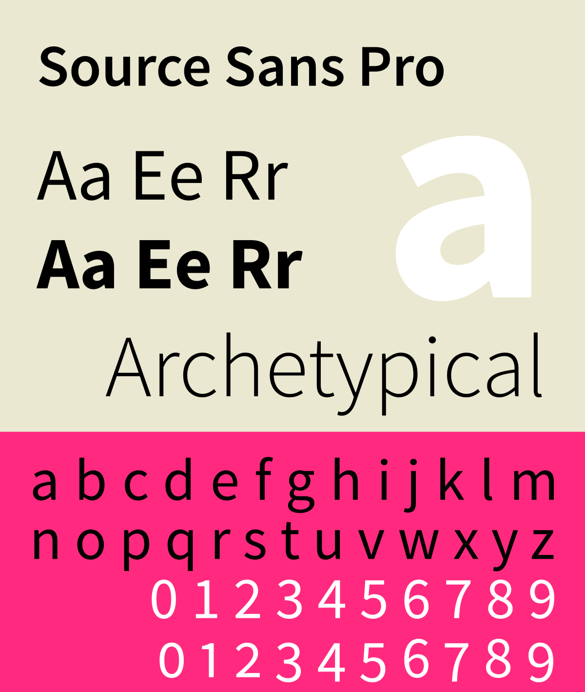

# PowerShell

# Included Tech Fonts (Coding and Terminal Fonts)

The following fonts will be installed automatically

## MonaLisa

[MonoLisa](https://www.monolisa.dev/)

## JetBrains NF

## Adobe Source Code Pro

[Source Code from Adobe Originals](https://fonts.adobe.com/fonts/source-code-pro)

[https://github.com/adobe-fonts/source-code-pro/releases](https://github.com/adobe-fonts/source-code-pro/releases)

## Cousine

[Cousine - Google Fonts](https://fonts.google.com/specimen/Cousine)

## Roboto

## Hasklug NF

## FiraCode NF

## Cascadia Code NF

## Monoid

## Go Mono NF
